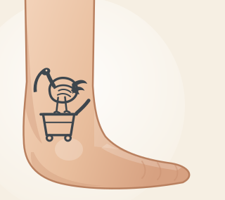

# Josh's Bin Chicken Tattoo Fund 🐦

A very small fundraiser app for one very specific cause: **11 mates, $200 AUD,
one bin chicken tattoo on Josh's ankle.**



## What it does

- **11 pledge spots.** Everyone types in their name and what they're good for.
- **A very clear "still to go".** Big running total, the amount left to raise, a
  progress bar with a bin chicken walking along it, and a row of 11 bin chicken
  icons that light up as each mate chips in.
- **Split evenly** divides the $200 across all 11 to the cent
  ($18.19 × 2 + $18.18 × 9 = exactly $200).
- **Goal reached** → the bird does a little jig and the app says so. Overshoot
  and it tells you how far over you are.
- **Shared between everyone.** Pledges live in a Supabase table, so every edit
  is saved and shows up on the other mates' phones within a few seconds. Edits
  made with no signal are kept on the device and pushed up automatically once
  the phone is back online.
- It's an honesty box for tracking who's in, not a payment system — no money
  changes hands here.

## Connecting the shared list

The app needs one free Supabase project to keep everyone's pledges in.

1. Create a project at [supabase.com](https://supabase.com) (free tier is plenty).
2. Open **SQL Editor**, paste in [`supabase/schema.sql`](supabase/schema.sql) and
   run it. That creates the `pledges` table with the 11 fixed spots and the row
   level security policies.
3. In **Project Settings → API**, copy the **Project URL** and the **publishable**
   key (labelled **anon public** on older projects) into
   [`js/config.js`](js/config.js). Never the secret / service_role key — that one
   bypasses every policy below.

Both values are browser keys and are meant to be public; what protects the data
is the RLS policy, which allows reading and updating the 11 existing rows and
nothing else — no inserts, no deletes, no access to anything else in the project.
Anyone with the link can edit the list, which is rather the point.

With `js/config.js` left blank the app still runs, saving pledges on the device
only, and says so.

## Install it on an iPhone

Open the site in Safari → Share → **Add to Home Screen**. It runs full screen,
has its own icon, and works offline (service worker + manifest).

## Tech

Plain static site: one HTML file, one stylesheet, one ES module. No build step,
no dependencies, no tracking. The artwork (the bin chicken icon and the
tattooed ankle) is hand-drawn SVG.

```
index.html              The app
css/app.css             Styles (light + dark)
js/app.js               UI, totals, progress, sync loop
js/store.js             Shared Supabase store + on-device mirror
js/config.js            Your Supabase project URL and anon key
supabase/schema.sql     Table, seed rows and RLS policies
assets/bin-chicken.svg  The bin chicken (Australian white ibis)
assets/ankle-tattoo.svg The ankle, wearing the tattoo
assets/icon*.png|svg    App icons
manifest.webmanifest    PWA manifest
sw.js                   Service worker (offline)
```

## Run locally

```bash
python3 -m http.server 8000
# then open http://localhost:8000
```

## Deployment (GitHub Pages)

`.github/workflows/deploy-pages.yml` publishes the site on every push to `main`.
**One-time setup:** in the repository, go to **Settings → Pages → Build and
deployment → Source: GitHub Actions**. The app is then live at
`https://silvanhaes-code.github.io/bin-chicken-tattoo-fund/`.
